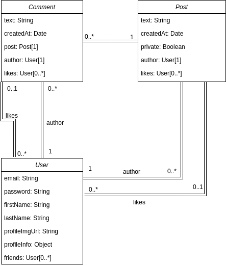

# In-tune (Odin-Book) (server segment)
## Description
This project is the part of the [TOP project: Odin-Book](https://www.theodinproject.com/lessons/nodejs-odin-book). This part represents backend which serves the [client segment]().

**API services:**
- register and log in users with plain email and password
- log in users with their google accounts
- edit profile page and download avatars
- add users as friends
- create and delete posts
- create and delete comments
## Data Models

## Technologies used
- NodeJS
- Express
- MongoDB database
- Mongoose
- jsonwebtoken
- passport
- imagekit